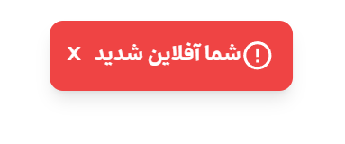

# react-offline-detector

[](https://badge.fury.io/js/react-offline-detector)


`react-offline-detector` is a simple and efficient React hook that helps you detect the user's online/offline status. This hook provides a boolean value that represents whether the user is offline or online, allowing you to build responsive apps that adapt to network changes.

---

### Output Example 1 (detect offline/online users)





## Features

- **Detects online/offline status in real-time.**
- **Easy-to-use React hook (useOfflineDetector).**
- **Works seamlessly in any React + TypeScript project.**
- **Fully customizable UI for displaying offline status.**
- **Lightweight and without any dependencies.**

---

## Installation

To install the react-offline-detector package, run the following command in your React project:

```bash
npm install react-offline-detector
```

Or with Yarn:

```bash
yarn add react-offline-detector
```

---

## Usage

### 1. Basic Setup

Once the library is installed, you can easily use the useOfflineDetector hook to get the user's current network status. This hook returns a boolean (true for offline, false for online), which you can use to display status messages or modify the UI based on the connection state.


```tsx
const MyComponent: React.FC = () => {
  const isOffline = useOfflineDetector(); // Get the offline status

  return (
    <div>
      {isOffline ? (
        <p>You are currently offline. Please check your internet connection.</p>
      ) : (
        <p>You are online!</p>
      )}
    </div>
  );
};

export default MyComponent;
```

### 2. API Reference

useOfflineDetector Returns a boolean value :
- **true**: if the user is offline.
- **false**:  if the user is online.

---

## Contributing

If you'd like to contribute to the project, feel free to fork the repository and submit pull requests. Contributions such as bug fixes, features, or improvements are always welcome.

